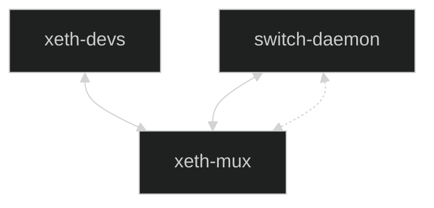
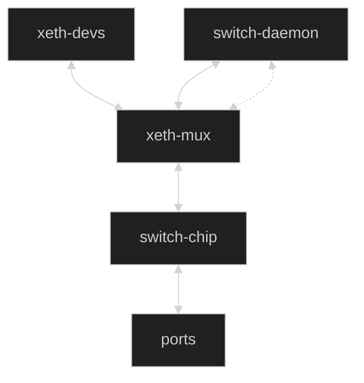
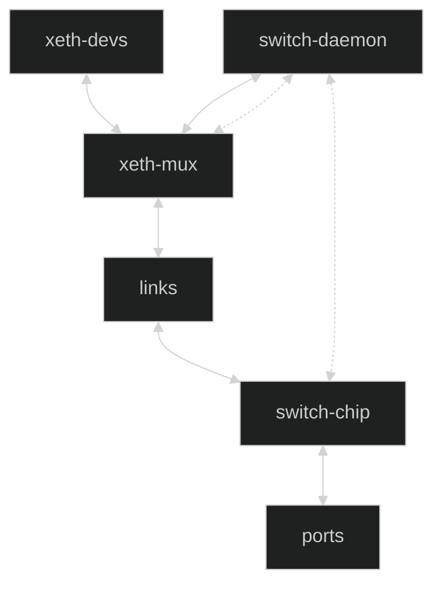
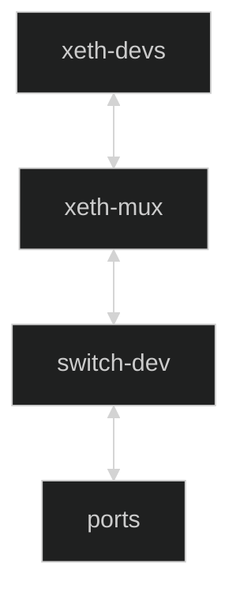
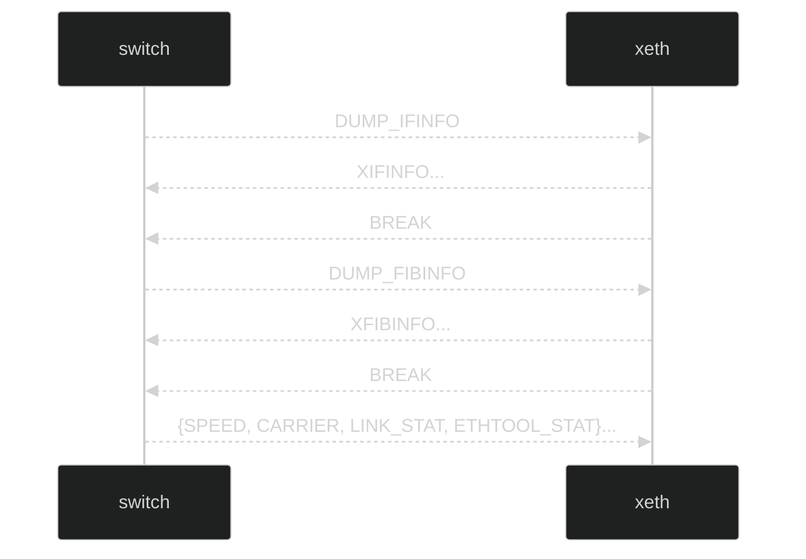

# Multiplex Proxy Ethernet Devices

The `xeth` Linux module provides the `xeth-mux` network device driver that
uses encapsulation to multiplex its virtual devices that proxy for ports
and functions of an on-board or remote switch chip.

## Modes

The mux may operate in these modes: *switch-less*, *unlinked-switch*,
*linked-switch*, and *switch-driver*.

### switch-less

In switch-less mode a daemon models a chip in development or provides a
network simulation for protocol development where each frame is encapsulated
and forwarded through a raw socket (bold line.)

The daemon and mux are also connected by a `SEQPACKET` socket for
side band messages (dashed line.)



### unlinked switch

In unlinked-switch mode a daemon has vfio-pci control (dotted line)
of the switch chip.



### linked switch

In linked-switch mode The daemon has vfio-pci control of the switch
chip which forwards encapsulated frames through the mux lower device
links.



### switch driver

In switch driver mode a lower level driver controls the chip and
forwards encapsulated<br> frames through the mux like the above links.



## Exceptions

In switch-less and unlinked-switch modes, all received frames are
encapsulated and marked before forwarding through a raw socket to the mux.

In linked-switch mode the switch chip may be unable to encapsulate and
forward some frames like ARP requests, TTL=1; so the daemon also forwards
these through a raw socket to the mux.

The mux transmit vector distinguishes the marked encapsulation to
de-multiplex and receive through the associated proxy device
(e.g. vlan priority 7.)

The mux recognizes switch-less mode by it not having any lower links and
forwards all proxy transmit frames with unmarked encapsulation to the
daemon's raw socket through its own receive handler.

In any other mode the mux encapsulates transmit frames before sending
through a hash identified lower link.

## Platform Interface

The `xeth` module includes mux and port platform drivers that when
probed through the matching compatibility entries, instantiate the
respective mux and port network devices with the properties given
by the firmware though device tree and ACPI.

type | property | default
---- | :------: | :-----:
&nbsp; | **mux** | &nbsp;
`string` | compatible | "xeth,mux"
`string` | name | "xeth-mux"
`u8` | encap | 0 (vlan)
`u1`6 | ports | 32
`u8[6]` | link0-mac-address | none
`u8[6]` | link1-mac-address | none
`u8[6]` | link2-mac-address | none
`u8[6]` | link3-mac-address | none
`u8[6]` | link4-mac-address | none
`u8[6]` | link5-mac-address | none
`u8[6]` | link6-mac-address | none
`u8[6]` | link7-mac-address | none
`string[]` | link-akas | none
`u8` | txqs | 1
`u8` | rxqs | 1
`string[]` | priv-flags | none
`string[]` | stat-names | none
`u8[2]` | qsfp-i2c-addrs | { 0x50, 0x51 }
&nbsp; | **port** | &nbsp;
`string` | compatible | "xeth,port"
`string` | name | "xeth%"
`string` | mux | "xeth-mux"
`u8[6]` | mac-address | random
`u8` | qsfp-bus | none
`u8` | txqs | 1
`u8` | rxqs | 1

## Admin

In addition to platform instantiated devices, an administrator may
create a mux through rtnl with iproute2.

```console
# ip link add [NAME] [link DEV] type xeth-mux [encap ENCAP]
```

The mode is implied from the link parameter: if given, the mux is
in either linked-switch or switch-driver mode; otherwise it's in
switch-less or unlinked-switch modes.

The admin may also create `xeth` proxy devices with these
iproute2 commands.

```console
# ip link add [NAME] link XETH_MUX type xeth-port [xid XID]
# ip link add [NAME] link XETH_MUX type xeth-loopback [channel ID]
# ip link add [NAME] link XETH_PORT type xeth-lag
# ip link set ANOTHER_XETH_PORT master XETH_LAG
# ip link add [NAME.VLAN] link XETH_PORT_OR_LAG type xeth-vlan [vid VID]
# ip link add [NAME] link XETH_PORT_LAG_OR_VLAN type xeth-bridge
# ip link set ANOTHER_XETH_PORT_LAG_OR_VLAN master XETH_BRIDGE
```

## L2 Forwarding Offload

The switch offloads forwarding for all devices by default.
Each device may be configured to defer to Linux forwarding with:

```console
# ethtool -K XETH_DEV l2-fwd-offload off
```

## side band protocol

On admin-up, the mux opens it's @NAME socket for a side band protocol
with a switch daemon through a SEQPACKET connection.

For switch-driver mode, the protocol messages are designed to be
distinguishable from through traffic so the protocol is actually
encoded in-band.

The mux provides the following information to the switch daemon
or driver:

* proxy interfaces
* FIB
* neighbor entries

The switch daemon or driver provides this to the `xeth-mux`:

* port carrier state
* port ethtool stats
* proxy link stats

Either daemon or switch driver initiate this protocol with a
`DUMP_IFINFO` request.



Where,

* XIFINFO
  Extended interface info for each proxy device:
  IFINFO, ETHTOOL_FLAGS, IFA, IFA6, and UPPER devices

* XFIBINFO
  Extended forwarding info of each network:
  FIBENTRY, FIB6ENTRY, NEIGH_UPDATE, NETNS_ADD, NETNS_DEL

After the BREAK reply to the DUMP_FIBINFO request, the mux continues
sending FIB and interface updates while the daemon or switch driver
relays negotiated port speed, carrier state, and periodic stats.

See [dkms/xeth_uapi.h](dkms/xeth_uapi.h) for message definitions.
